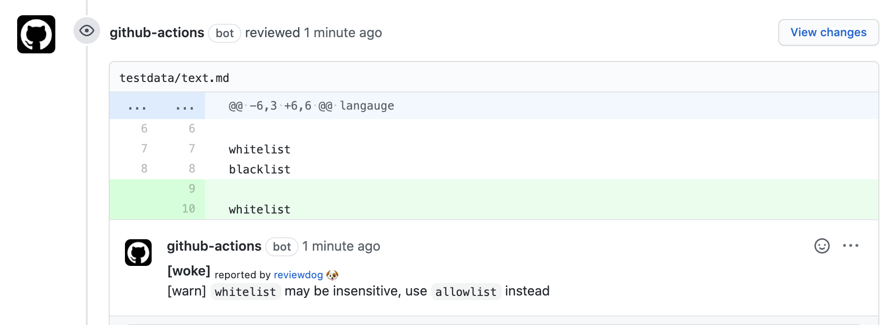
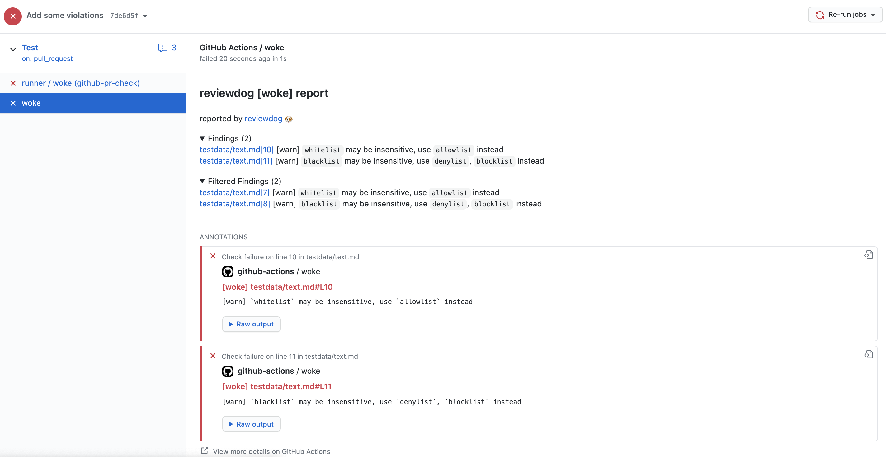
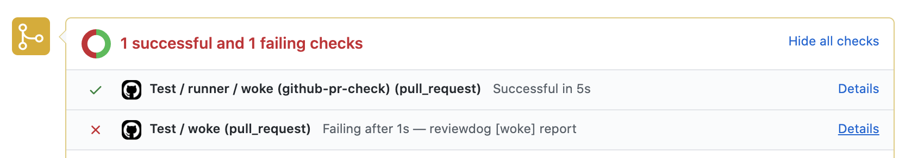

# woke-action-reviewdog

[](https://github.com/get-woke/woke-action-reviewdog/actions?query=workflow%3ATest)
[](https://github.com/get-woke/woke-action-reviewdog/releases)

Woke GitHub Actions allow you to execute [`woke`](https://github.com/get-woke/woke) command within GitHub Actions.

This GitHub action uses [reviewdog](https://github.com/reviewdog/reviewdog)

## Inputs

Inputs to configure the `woke` GitHub Actions.

| Input            | Default               | Description                                                                                  |
|------------------|-----------------------|----------------------------------------------------------------------------------------------|
| `woke-args`      | `.`                   | (Optional) Additional flags to run woke with (see <https://github.com/get-woke/woke#usage>)  |
| `woke-version`   | latest                | (Optional) Release version of `woke` (defaults to latest version)                            |
| `fail-on-error`  | `false`               | (Optional) Fail the GitHub Actions check for any failures.                                   |
| `reporter`       | `github-pr-check`     | (Optional) Reviewdog reporter. See <https://github.com/reviewdog/reviewdog#reporters>        |
| `filter-mode`    | `added`               | (Optional) Reviewdog filter mode. See <https://github.com/reviewdog/reviewdog#filter-mode>   |
| `level`          | `error`               | (Optional) Report level for reviewdog [info,warning,error].                                  |
| `reviewdog-flags`|                       | (Optional) Additional reviewdog flags                                                        |
| `workdir`        | `.`                   | (Optional) Run `woke` this working directory relative to the root directory.                 |
| `github-token`   | `${{ github.token }}` | (Optional) Custom GitHub Access token (ie `${{ secrets.MY_CUSTOM_TOKEN }}`).                 |

## Usage

```yaml
name: woke
on: [pull_request]
jobs:
  linter_name:
    name: runner / woke
    runs-on: ubuntu-latest
    steps:
      - uses: actions/checkout@v2
      - uses: get-woke/woke-action-reviewdog@v0
        with:
          github-token: ${{ secrets.GITHUB_TOKEN }}
          # Change reviewdog reporter if you need [github-pr-check,github-check,github-pr-review].
          reporter: github-pr-review
          # Change reporter level if you need.
          # GitHub Status Check won't become failure with warning.
          level: warning
          # Enable this to fail the check when violations are found
          # fail-on-error: true
```

### Examples

#### `github-pr-review`

Details: <https://github.com/reviewdog/reviewdog#reporter-github-pullrequest-review-comment--reportergithub-pr-review>

This  reporter will create a PR comment with any violations found

```yaml
reporter: github-pr-review

# Uncomment this to cause the PR check to fail
# otherwise it will still post the comment on violations,
# but the PR check will succeed
fail-on-error: true
```



**NOTE** this reporter will not clean up duplicated comments from violations that
exist after multiple pushes. This can cause a lot of extra comments.
See <https://github.com/reviewdog/reviewdog/issues/568>

#### `github-pr-check`

Details: <https://github.com/reviewdog/reviewdog#reporter-github-checks--reportergithub-pr-check>

This reporter will create annotations in the "Checks" tab of the PR, but will not comment on
the actual PR. This is slightly better than `github-pr-review` as it doesn't clutter your
PR with comments, but you do have to go into the `Checks` tab to view issues.

```yaml
reporter: github-pr-check
```

Checks suite with annotations of violations


PR checks (both will fail on violation with `fail-on-error: true`)


### Filter mode

Details: <https://github.com/reviewdog/reviewdog#filter-mode>

By default, only `added` lines will cause reviewdog to annotate/comment on lines that have
been added in the PR. See above link for more options.

## License

This application is licensed under the MIT License, you may obtain a copy of it
[here](https://github.com/get-woke/woke-action-reviewdog/blob/main/LICENSE).
